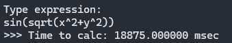
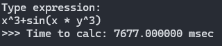

## Program profiling

- Added `<time.h>` header and used `clock()` func for determination of the program execution time in `computePoints()`

- Computational complexity

	The most difficult func of the program is `computePoints()`. Consider it:

	0. Let's denote be the complexity of the function `calculate_expression()` by `M`.
	1. Algorithm goes through the ranges `x` and `y` with `diapStep`.
	2. For every point with coordinates `(x, y)` calls `calcullate_expression()`.
	3. Remaining operations equal O(1) complexity.
	
	So, the complexity of the primal algorithm:

	

- First program tests

	- sin(sqrt(x^2 + y^2))

	
	
	- x^2 + y^2

	
	
	- x^3 + sin(x * y^3)

	

## Machine - independent optimization

- Out of cycle

	In `computePoints()` outed from cycle needed memory calculating and allocation.
	*We know the quantity of points in start, which coordinates need to calculate.*
	In `DrawUpdated()` outed from cycle calculating quantity of points.

- Out in variable 

	In `Dijkstra()` func outed multiple `get()` call in variable `value`.

- Adding new condition

	In `get()` func added comparison of first letters, that minimize `strcmp` calls.

- Second program tests

	- sin(sqrt(x^2 + y^2))

	
	
	- x^2 + y^2 
	
	
	
	- x^3 + sin(x * y^3)
	
	

## Algorithmic optimization

Main idea - using *interpolation*.

Ideal interpolation method for our task is bilinear interpolation.
*We need maximize speed and can ignore functions with very crooked lines*.

> In mathematics, [**bilinear interpolation**](https://en.wikipedia.org/wiki/Bilinear_interpolation) is a method for interpolating functions of two variables (e.g., x and y) using repeated linear interpolation.

In `computePoints()`:

- First cycle construct a `raw` grid of coordinates (coordinates for every Nth point) with `calculate_expression()` func.
- Second cycle construct a `soft` grid of coordinates (coordinates for remaining point) with interpolation func (`BilinearInterpolation()`)

*Example for 50 elements and N = 10*:

*Index of point in points array*:

Where X1, X2, Y1, Y2 is coordinates of nearest `raw` grid points

- Third program test

	- sin(sqrt(x^2 + y^2))

	
	
	- x^2 + y^2

	
	
	- x^3 + sin(x * y^3)

	

For math functions with very crooked lines we can see deviations. 

For example, `x^3 + sin(x * y^3)` function with N = 10:

*\*But we can reduce N to minimize artefacts*

- Computational complexity

	Also consider `computePoints()`:

	0. Denoted be the complexity of the function `calculate_expression()` by `M`.
	1. Algorithm goes through the ranges `x` and `y` with `diapStep * N` in first cycle.
	2. For every point with coordinates `(x, y)` calls `calcullate_expression()`.
	3. Remaining operations of first cycle equal O(1) complexity.
	4. Algorithm goes through the ranges `x` and `y` with `diapStep` in second cycle.
	5. For every uncalculated point with coordinates `(x, y)` calls `BilinearInterpolation()`.
	6. Remaining operations of second cycle equal O(1) complexity.
	
	So, the complexity of the optimizated algorithm:

	
	
	With considering that `M/100` equal O(1):

	
	 